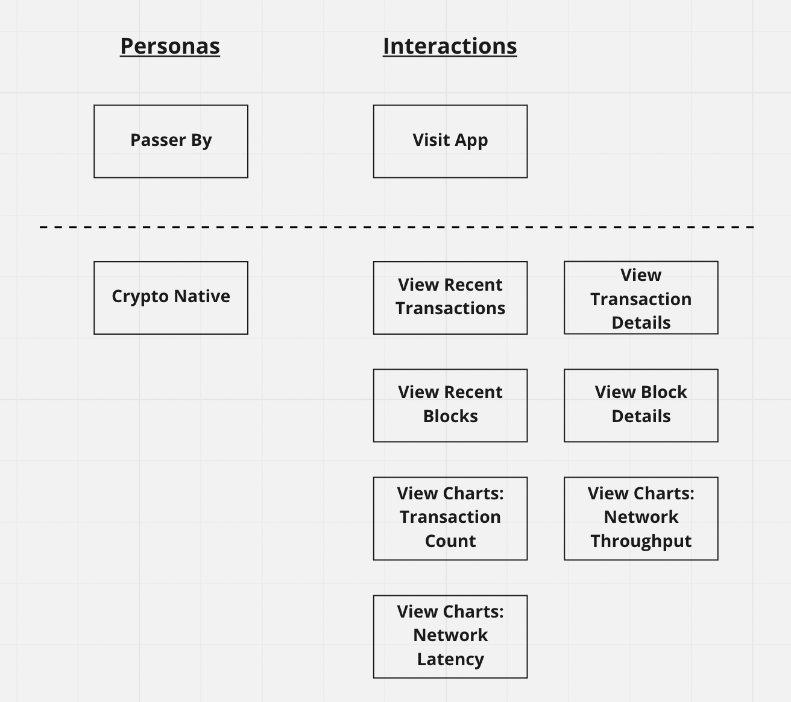
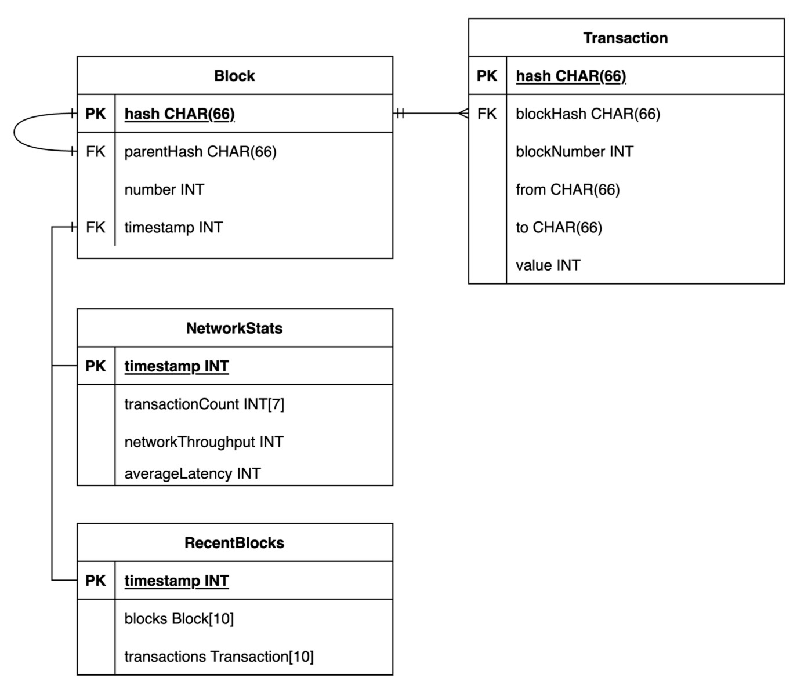
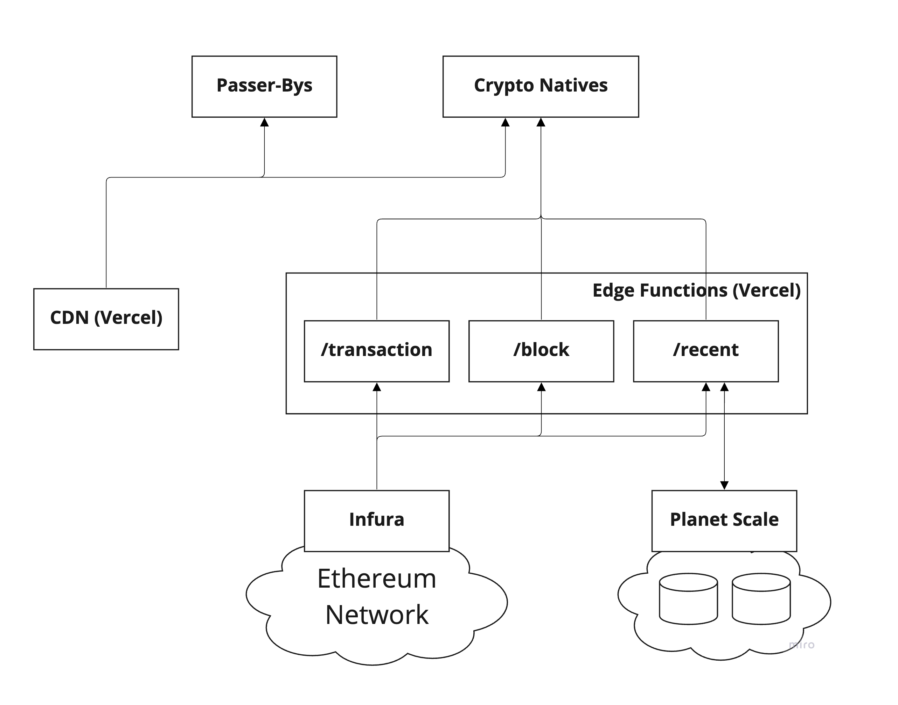

# Etherscan-Clone
This is an example project to demonstrate the use of modern web techniques with Web3.

View the application live [here](https://sh4nnongoh-etherscan-clone.vercel.app/).

The business requirements are as follows:
* ability to search for a specific transaction hash or block number
* display recent transactions and blocks
* a time-series chart displaying the previous 7 days transactions count, network throughput, and average latency.

## Table of Contents
-----
1. [Quick Start](#Quick-Start)
2. [System Design](#System-Design)
    * [DDD Strategic Design](#DDD-Strategic-Design)
    * [DDD Tactical Design](#DDD-Tactical-Design)
    * [API Endpoints](#API-Endpoints)
    * [Capacity Estimation](#Capacity-Estimation)
    * [System Architecture](#System-Architecture)
3. [Software Architecture](#Software-Architecture)
    * [Managing Application State](#Managing-Application-State)
    * [Test Driven Development](#Managing-Application-State)

## Quick Start
-----

```
// Install Packages
yarn

// Execute Lint
yarn lint

// Execute Tests
yarn test
```
You may start the web application locally, but may need access to Vercel environment variables to properly run the app. If you are part of the project team, do run the following commands to obtain the appropriate environment variables
```
yarn vercel link
yarn vercel env pull
```

### Available Scripts

Refer to `package.json`, for the full list of available commands.

## System Design
-----
_The purpose of system design is to translate business requirements into __actionable artefacts__ that can be __iterated__ upon by stakeholders throughout the __system lifecycle__. My approach to system design incorporates elements of __Domain Driven Design (DDD)__, demonstrated in the stages below._

### __DDD Strategic Design__
_The goal of strategic design is to formalize the language used by all stakeholders in the context of the system domain. There are multiple methods to achieve this, but I rely on a simple domain user story diagram that identifies the various personas interacting with the system and the actions performed._

_Once the domain story diagram is done up, it can be translated into a formal language that can be categorized into 3 categories: __(1) Events; (2) Objects; (3) Transactions__._

_Events represent the past and act as the source of truth. Objects are models that represent the current state of the domain. Transactions within the domain, create events that changes the various models of the domain._

The domain of __```Etherscan-Clone```__ is as follows:



There are two personas that can be identified: _(1) Passer-By; (2) Crypto Natives_. As the application will be accesible to anyone in the public, we will need to take into account people who visit the site by chance or through social links.

| Events        | Objects       | Transactions
| ---           | ---           | ---
| Transaction   | NetworkStats  | -
| Block         | RecentBlocks  | -

As the application is currently _read-only_, there are no domain transactions. The domain events stated are created from the Ethereum domain, and the Etherscan-Clone domain will be subscribing to those events. The identified objects are derived from the expected interactions of the users.

### __DDD Tactical Design__
_The goal of the tactical design stage is to come up with software artefacts that model the software architecture of the system. Software engineers rely on these artefacts to ensure that the system is built correctly._



Based on the events and objects identified in the _Strategic Design_ stage, the above Entity-Relationship diagram is drawn.

### __API Endpoints__
For this project, we will be relying on [Infura](https://docs.infura.io/infura/networks/ethereum/json-rpc-methods) to retrieve information from the ethereum blockchain. As an API key will be required, we will encapsulate the Infura calls within our own edge functions as follows:
```
/api/v1/recent/
/api/v1/transaction/?hash={string}
/api/v1/block/?number={number}
```
The endpoinds are derived from the needs of the personas identified in the _Strategic Design_ stage.
### __Capacity Estimation__
| Ethereum Block Time   | Traffic Estimation                | Requests Estimation   | 7-days Storage
| ---                   | ---                               | ---                   | --
| __~10 seconds__       | __~1M DAU__ or __~10 users/sec__  | __~10 requests/sec__  | __~3GB__

By referencing the number of daily active address, along with the fact that there are passer-by visiting the site, we can assume 1 million daily active users ([source](https://ycharts.com/indicators/ethereum_daily_active_addresses)). 

The ethereum block time can be estimated to be at least 10 seconds ([source](https://ycharts.com/indicators/ethereum_average_block_time)).

Based on the information above, we can estimate that visitors to the Home page will trigger approximately 10 API requests every second.

Based on the needs of the project, a subset of the ```Block``` object will be stored in a database to enable efficient calculation of the ```NetworkStats``` object:

* __Int__: 4 bytes
* __Char__: 1 byte * size
* __Block__: 66 bytes + 66 bytes + 4 bytes + 4 bytes + 4 bytes = 144 bytes

Given that there are approximately 10 thousand blocks produced in a day, the storage needed to store 7 days worth of objects can be calculated as follows:

* ( 144 bytes * 10,000 ) * 7 
= 1,440,000 bytes
= __~1.44MB__

### __System Architecture__


Passer-by visiting the Home page do not need to trigger any API requests as the initial content will be prerendered onto the HTML page and deployed on the CDN.

Crypto natives tend to stay longer on the site, and may trigger the ```/recent``` endpoint to rehydrate the Home page with up-to-date content. By interacting with the search bar, they may also trigger additional requests.

A database service is used to store at least 7 days worth of transaction information to allow for efficient lookup of recent transactions, hence allowing the prerendering of the Home page with the appropriate content.

## Software Architecture
-----

### Managing Application State
React's ```useContext```, ```useState``` and other hooks, will be used to manage the application state.

### Test Driven Development
Navigating to `src/tests` , one can see that the tests are written in a way that mimics the actual `User Story`. This acts as a contract between developers and the product owner as to what features have been completed, and will carry on to exist throughout the product lifecycle. With `React Testing Library (RTL)`, writing `User Story` tests that mimics actual user behavior is made possible, while also being able to execute as fast as how traditonal unit tests do.
